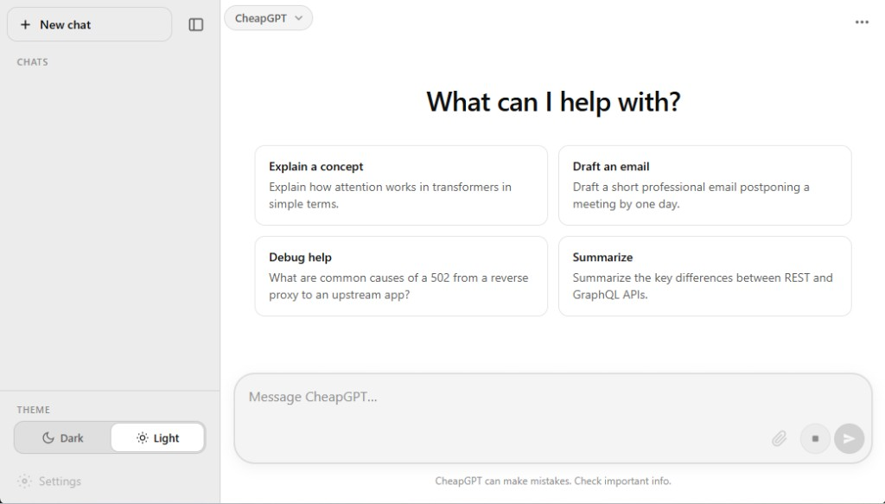

# CheapGPT

CheapGPT is a lightweight ChatGPT-style web UI served by FastAPI, with chat responses proxied to a local or remote Ollama instance.



## Features

- ChatGPT-like interface with chat history
- Streaming responses from Ollama
- Model picker from Ollama `/api/tags`
- Share modal with copy conversation support
- Single-process app: backend + static frontend

## Requirements

- Python 3.10+
- [Ollama](https://ollama.com/) running and reachable
- At least one pulled model (example: `ollama pull llama3.2`)

## Install

From the project root:

```powershell
python -m venv .venv
.venv\Scripts\Activate.ps1
pip install -r requirements.txt
```

## Configuration

CheapGPT reads these environment variables:

- `OLLAMA_HOST` (default: `http://127.0.0.1:11434`)
- `CHEAPGPT_MODEL` (default: `llama3.2`)

### Recommended: `.env` file (not committed)

1. Copy the sample file:

```bash
cp .env.example .env
```

1. Edit `.env` for your setup:

```env
OLLAMA_HOST=http://windows-ollama:11434
CHEAPGPT_MODEL=llama3.2
```

Keep your actual settings in `.env`, and use `.env.example` as the starter template.

Example (PowerShell, using Ollama on another computer):

```powershell
$env:OLLAMA_HOST = "http://windows-ollama:11434"
$env:CHEAPGPT_MODEL = "llama3.2"
```

> Recommended: set `OLLAMA_HOST` explicitly for your setup. Use `http://127.0.0.1:11434` for same-machine Ollama, or a hostname like `http://windows-ollama:11434` for cross-machine access.

If you want to load `.env` in shell before starting:

```bash
set -a
source .env
set +a
```

## Run (Development)

```powershell
.venv\Scripts\Activate.ps1
uvicorn main:app --reload --host 127.0.0.1 --port 8000
```

Then open: [http://127.0.0.1:8000](http://127.0.0.1:8000)

## Run (Production-style, foreground)

```powershell
.venv\Scripts\Activate.ps1
uvicorn main:app --host 0.0.0.0 --port 8000
```

Use `127.0.0.1` if you only want local access.

## Open in your browser

After the server starts, open one of these URLs:

- Local on the same machine: `http://127.0.0.1:8000`
- Another device on your network or Tailnet (when running with `--host 0.0.0.0`): `http://<server-ip>:8000`
- Public URL via Tailscale Funnel: `https://<your-node>.ts.net`

Quick checks if it does not open:

- Confirm service is running: `systemctl status cheapgpt` (Linux service) or check the terminal output.
- Confirm the port: match the URL to your `--port` value.
- Confirm network path: use the server's Tailscale IP or LAN IP from the client device.

## Anywhere Access with Tailscale

Use Tailscale to reach CheapGPT securely from your other devices without opening router ports.

### Option A: Private access on your Tailnet (recommended)

1. Install and sign in to Tailscale on the CheapGPT host:

```bash
curl -fsSL https://tailscale.com/install.sh | sh
sudo tailscale up
tailscale ip -4
```

1. Keep CheapGPT listening on all interfaces:

```powershell
.venv\Scripts\Activate.ps1
uvicorn main:app --host 0.0.0.0 --port 8000
```

1. On any device logged into the same Tailscale account (or shared Tailnet), open:

`http://<tailscale-ip>:8000`

Example:

`http://100.101.102.103:8000`

1. (Optional but recommended) Restrict access with Tailscale ACLs so only approved users/devices can reach port `8000`.

### Option B: Public URL with Tailscale Funnel (optional)

If you want internet-accessible HTTPS without exposing your home IP directly:

```bash
sudo tailscale funnel 8000
```

Tailscale will print an HTTPS URL (for example `https://your-node-name.ts.net`). Open that URL from anywhere.

To stop Funnel:

```bash
sudo tailscale funnel reset
```

> Security note: Funnel makes your app publicly reachable. Use only when needed.

## Run as a Service

### Windows (NSSM)

[NSSM](https://nssm.cc/) is an easy way to run Python apps as Windows services.

1. Install NSSM and ensure `nssm.exe` is available.
2. Open an elevated PowerShell.
3. Create the service:

```powershell
nssm install CheapGPT
```

In the NSSM dialog set:

- **Application path**: `C:\dev\CheapGPT\.venv\Scripts\python.exe`
- **Startup directory**: `C:\dev\CheapGPT`
- **Arguments**: `-m uvicorn main:app --host 127.0.0.1 --port 8000`

Set environment variables in NSSM (AppEnvironmentExtra), for example:

- `OLLAMA_HOST=http://127.0.0.1:11434`
- `CHEAPGPT_MODEL=llama3.2`

Then start:

```powershell
nssm start CheapGPT
```

Stop/remove:

```powershell
nssm stop CheapGPT
nssm remove CheapGPT confirm
```

### Linux (systemd)

Create `/etc/systemd/system/cheapgpt.service`:

```ini
[Unit]
Description=CheapGPT FastAPI service
After=network-online.target
Wants=network-online.target

[Service]
Type=simple
User=YOUR_USER
WorkingDirectory=/opt/CheapGPT
EnvironmentFile=/etc/cheapgpt.env
ExecStart=/opt/CheapGPT/.venv/bin/python -m uvicorn main:app --host 127.0.0.1 --port 8000
Restart=always
RestartSec=3

[Install]
WantedBy=multi-user.target
```

Create `/etc/cheapgpt.env` (outside the repo), for example:

```bash
OLLAMA_HOST=http://127.0.0.1:11434
CHEAPGPT_MODEL=llama3.2
```

For Tailscale remote access, change `--host 127.0.0.1` to `--host 0.0.0.0`.
Also ensure Tailscale is enabled:

```bash
sudo systemctl enable --now tailscaled
sudo tailscale up
tailscale status
```

Enable/start:

```bash
sudo systemctl daemon-reload
sudo systemctl enable cheapgpt
sudo systemctl start cheapgpt
sudo systemctl status cheapgpt
```

Logs:

```bash
journalctl -u cheapgpt -f
```

## API Endpoints

- `GET /api/health` - health + Ollama reachability
- `GET /api/models` - available models for picker
- `POST /api/chat` - streaming chat endpoint used by the UI

## Troubleshooting

- `**Cannot reach Ollama**`
  - Verify Ollama is running: `ollama list`
  - Check `OLLAMA_HOST` points to the correct host/port
- **No models shown**
  - Pull one first: `ollama pull llama3.2`
- **Port already in use**
  - Run with another port, e.g. `--port 8080`

## Project Layout

- `main.py` - FastAPI app and Ollama proxy
- `web/index.html` - UI shell
- `web/js/chat.js` - chat logic and streaming UI
- `web/css/chatgpt.css` - styling

